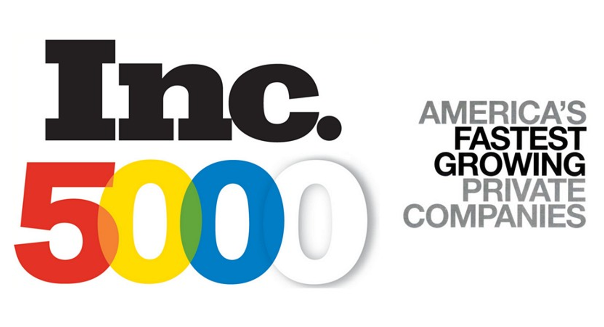

# ETL-Project

## Unveil the Top Fastest-Growing Private Companies in America for the last twelve years (2007-2019) 
                          
  

### Project Proposal

This project is designed to conduct a presentation of business information or Business Intelligence by extracting, trasnfroming, and loading the top fastest-growing private companies in America for the last twelve years (2007-2019).

We are going to use three datasets from the public data platform called Data World which leads us to extract the fastest-growing private companies in America sourced from [Inc 5000](https://www.inc.com/inc5000/2019/top-private-companies-2019-inc5000.html).

Inc. is an American business magazine founded in 1979 and based in New York City. It publishes eight print issues annually, as well as daily online articles and videos. Inc. is best known for its annual rankings of the fastest-growing privately held companies in the United States, called the "Inc. 500" and "Inc. 5000."
In this project we are gone extract, trasnfrom and load twelve years (2007-2019) Inc 5000 fastest-growing private companies.

### Finding Data/Data Source/Extract
All of our data is sourced from the year 2007 up to 2019. 

* INC 5000 America
  - [Data World Inc 5000,2019](https://data.world/aurielle/inc-5000-2019/workspace/file?filename=inc5000-2019.csv)
  - [Data World Inc 5000,2018](https://data.world/aurielle/inc-5000-2018/workspace/file?filename=inc5000-2018.csv)
  - [Data World Inc 5000,2017](https://data.world/aurielle/inc-5000-10-years/workspace/file?filename=inc5000_all10years.csv)
 

### Data Cleanup & Analysis

#### Transformation

- We will gone use Pandas functions in Jupyter Notebook to transform all CSV files.
- Reviewe the files and transformed into data frames
- Type of transformations needed (cleaning, joining, filtering, aggregating: etc). Several columns will not be needed and will be removed. 
- Duplicate rows will be removed, and need to be managed. 
- Some aggregation will also be done to find totals for comparison business in the dataset.

#### Load
- Type of final production database data will load into: Will use a relational database to link the data by our common identifiers.probably, Postgres database using PG admin to store our original clean data sets.

- Final tables/collections that will be used in the production database: New final table with found/calculated values by metrics.

### Project Report

