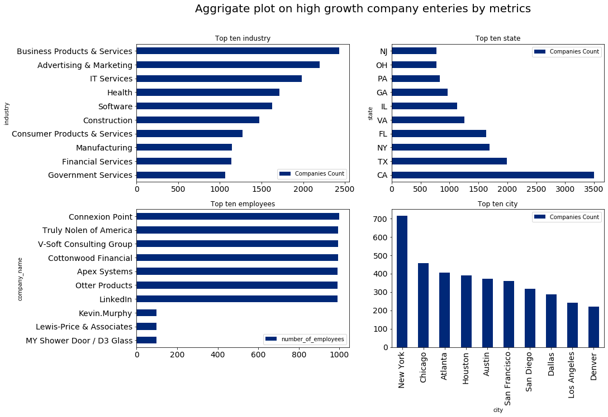

# ETL-Project

## Unveil the Top Fastest Growing Private Companies in America for the last thirteen years (2007 - 2020) 
                          

### Introduction

This project is designed to conduct a presentation of business information or Business Intelligence by extracting, transforming, and loading the top fastest-growing private companies in America for the last thirteen years (2007-2020).

The purpose of this project was to build a database that demonstrates the changes in American top fastest-growing private companies through time. The database is built on by ingesting, combining, and restructuring data from three main sources into a conformed one Postgresql database. The three sources of our data are [Inc 5000](https://www.inc.com/inc5000/), [Financial times ranking 500 2020](https://www.ft.com/americas-fastest-growing-companies-2020), and [Growjo Company API](https://growjo.com/company_api) for scraping fastest-growing companies in 2020.

### Data Extraction 
In this project we extracted, transformed, and loaded thirteen years (2007-2020) American top fastest-growing private companies. 

Our main sources:

- [Inc 5000 from year 2007 till 2019 - Data sourced from Data World Inc](https://www.inc.com/)
  - [Data World Inc 5000, 2019](https://data.world/aurielle/inc-5000-2019/workspace/file?filename=inc5000-2019.csv)
  - [Data World Inc 5000, 2018](https://data.world/aurielle/inc-5000-2018/workspace/file?filename=inc5000-2018.csv)
  - [Data World Inc 5000 (2007-2017)](https://data.world/aurielle/inc-5000-10-years/workspace/file?filename=inc5000_all10years.csv)
 
- [Financial times ranking 500 2020 - Data sourced through web scraping](https://www.ft.com/americas-fastest-growing-companies-2020)
  - [FT ranking 500 2020](https://www.ft.com/americas-fastest-growing-companies-2020)
  
- [Growjo Company list - Data sourced through API request](https://growjo.com/company_api)
  - We make an API call on the Growjo website and generated the company's information based on domains. For this reason, we prepared a python file called [company_domain.py](company_domain.py) that lists American top fastest-growing private companies domain, and we requested information for each domain and stored information in a data frame. For example, you could retrieve a company’s name, location, employee, estimated revenue, and job openings from their domain name. 

### Data Enginering 

After extracting the data we conducted a data engineering, and Entity-Relationship Diagram (ERD) by using an open-source toolkit called [Quickdatabasediagrams](https://app.quickdatabasediagrams.com/). 
The model looks as follows: 

### Data Transformation
* We used a Pandas functions in Jupyter Notebook to transform all CSV files, scraped data, and API request responses. 
* We reviewed the files and transforme into a dataframes.
* We used a python transformation functions for data cleaning, joining, filtering, and aggregating.
* Several columns removed
* Duplicate rows was removed, and successfully managed. 
* We conducted Some aggregation to find totals for comparison in the datasets.

### Load
* For our final production, we used a relational database called Postgresql, in a total of three tables, twelve columns created, and the data loaded successfully. 
- Final tables/collections are stored in the production database

#### Company Table
<table border="1" class="dataframe">
  <thead>
    <tr style="text-align: right;">
      <th></th>
      <th>id</th>
      <th>company_name</th>
      <th>number_of_employees</th>
      <th>industry</th>
      <th>city</th>
      <th>state</th>
      <th>country</th>
    </tr>
  </thead>
  <tbody>
    <tr>
      <th>0</th>
      <td>20391</td>
      <td>SwanLeap</td>
      <td>49.0</td>
      <td>Logistics &amp; Transportation</td>
      <td>Madison</td>
      <td>WI</td>
      <td>United States</td>
    </tr>
    <tr>
      <th>1</th>
      <td>16357</td>
      <td>PopSockets</td>
      <td>118.0</td>
      <td>Consumer Products &amp; Services</td>
      <td>Boulder</td>
      <td>CO</td>
      <td>United States</td>
    </tr>
    <tr>
      <th>2</th>
      <td>9922</td>
      <td>Home Chef</td>
      <td>865.0</td>
      <td>Food &amp; Beverage</td>
      <td>Chicago</td>
      <td>IL</td>
      <td>United States</td>
    </tr>
    <tr>
      <th>3</th>
      <td>22829</td>
      <td>Velocity Global</td>
      <td>55.0</td>
      <td>Business Products &amp; Services</td>
      <td>Denver</td>
      <td>CO</td>
      <td>United States</td>
    </tr>
    <tr>
      <th>4</th>
      <td>5896</td>
      <td>DEPCOM Power</td>
      <td>104.0</td>
      <td>Energy</td>
      <td>Scottsdale</td>
      <td>AZ</td>
      <td>United States</td>
    </tr>
  </tbody>
</table>

#### Ranks Table 
<table border="1" class="dataframe">
  <thead>
    <tr style="text-align: right;">
      <th></th>
      <th>id</th>
      <th>rank</th>
      <th>rank_year</th>
    </tr>
  </thead>
  <tbody>
    <tr>
      <th>0</th>
      <td>20391</td>
      <td>1</td>
      <td>2018</td>
    </tr>
    <tr>
      <th>1</th>
      <td>16357</td>
      <td>2</td>
      <td>2018</td>
    </tr>
    <tr>
      <th>2</th>
      <td>9922</td>
      <td>3</td>
      <td>2018</td>
    </tr>
    <tr>
      <th>3</th>
      <td>22829</td>
      <td>4</td>
      <td>2018</td>
    </tr>
    <tr>
      <th>4</th>
      <td>5896</td>
      <td>5</td>
      <td>2018</td>
    </tr>
  </tbody>
</table>

### Aggregate 
#### Total number of companies
<table border="1" class="dataframe">
  <thead>
    <tr style="text-align: right;">
      <th></th>
      <th>Total Companies</th>
    </tr>
  </thead>
  <tbody>
    <tr>
      <th>0</th>
      <td>24115</td>
    </tr>
  </tbody>
</table>

#### Aggrigate plot on High grwoth company enteries

### Team members
- Adedamola Atekoja (‘Damola)
- Amanda Qianyue Ma
- Amos Johnson
- Ermias Gaga
- Maria Lorena
